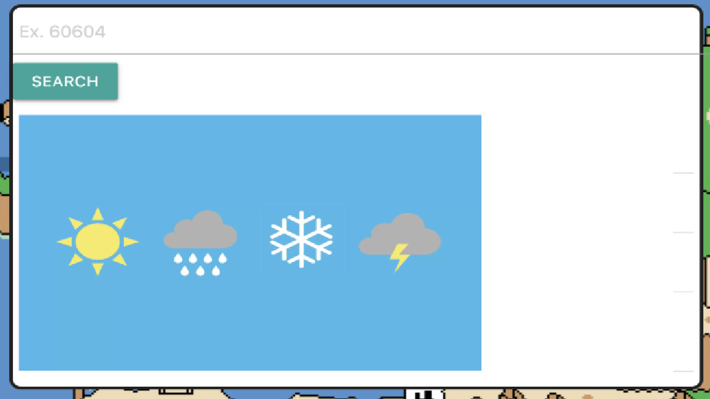
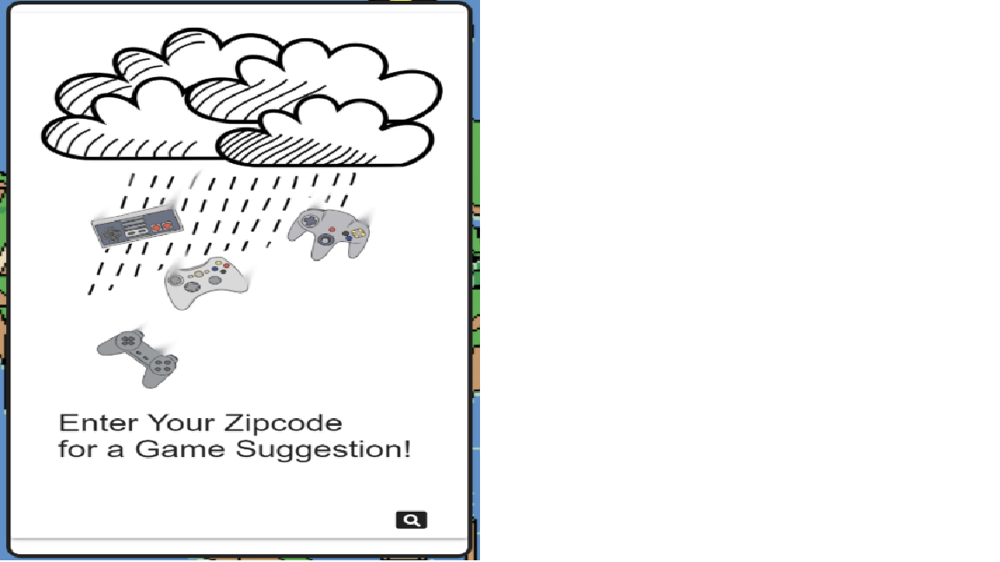

# Project Overview

Find a game for any weather! Enter your zip code and our application will recommend a game based on what temperature it is outside where 
you live. It uses the Open Weather APi to find the location's weather. Then uses that to find a random game with a story based near that
temperature and finds displays information about it using the Giant Bomb API. The goal of this is to tell users what to play when they 
can't decide for themselves.

# Other Topics to Explore

* Another thing we were hoping to add was a genre picker based on weather conditions (e.g. horror games for thunderstorms etc...)
* We also wanted to implement a gaming platforms checkbox to limit what consoles are relevant to the user

# Getting Started

## Live link: https://steam-user.github.io/steam-user/

# User Experience

Enter your zip code here.

Afterwards, a recommended game will show up in this box.

## You can keep putting in as many zip code as you want and it will keep updating the games too.

# Built With:

* Giant Bomb API
* Open Weather API
* Materialize.css
* Animate.css
* Semantic.css
* Jquery
* Moment.js
